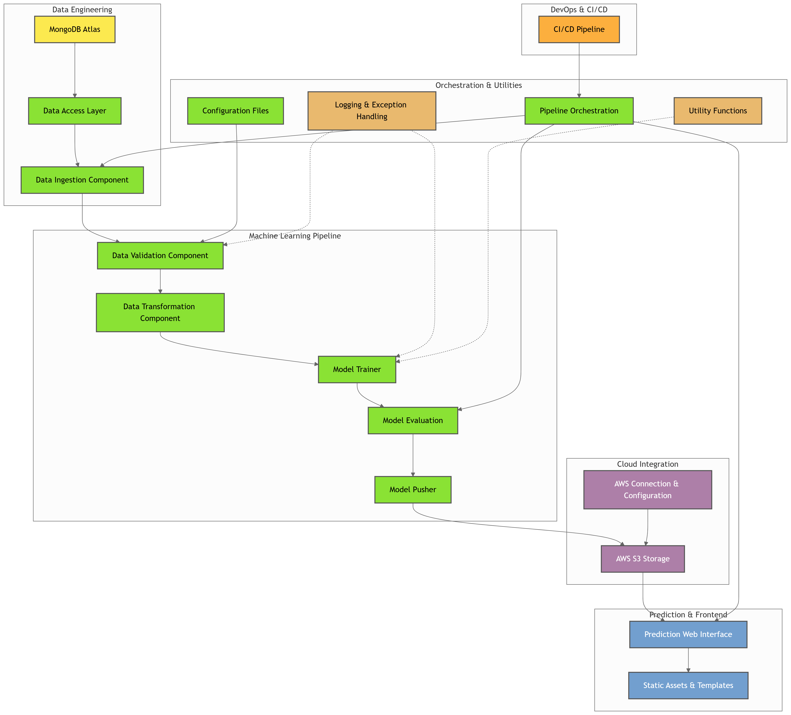

Vehicle Insurance Project
=========================

This repository demonstrates a full-stack machine learning pipeline—from data ingestion and preprocessing to model training, evaluation, and deployment—integrated with modern cloud services and CI/CD practices. The project leverages tools and services such as Python, Docker, MongoDB Atlas, AWS, and GitHub Actions to provide an end-to-end solution for vehicle insurance data processing and model management.

Table of Contents
-----------------

1.  [Project Setup](#project-setup)
    
2.  [Environment Setup](#environment-setup)
    
3.  [MongoDB Setup](#mongodb-setup)
    
4.  [Logging & Exception Handling](#logging--exception-handling)
    
5.  [Data Ingestion](#data-ingestion)
    
6.  [Data Validation, Transformation & Model Trainer](#data-validation-transformation--model-trainer)
    
7.  [AWS Integration & Model Management](#aws-integration--model-management)
    
8.  [Model Evaluation & Pusher](#model-evaluation--pusher)
    
9.  [Prediction Pipeline](#prediction-pipeline)
    
10.  [CI/CD & Deployment](#cicd--deployment)
    
11.  [How to Run](#how-to-run)
    
12.  [Conclusion](#conclusion)
    

Project Setup
-------------

*   **Template Initialization:**Run template.py to generate the project structure.
    
*   **Local Package Imports:**Update setup.py and pyproject.toml to correctly import local packages.See crashcourse.txt for detailed guidelines.
    

Environment Setup
-----------------

1.  bashCopyconda create -n vehicle python=3.10 -yconda activate vehicle
    
2.  **Install Dependencies**
    
    *   Add required modules to requirements.txt.
        
    *   bashCopypip install -r requirements.txtpip list # Verify local package installations
        

MongoDB Setup
-------------

1.  **MongoDB Atlas Configuration**
    
    *   Sign up for MongoDB Atlas and create a new project.
        
    *   In the "Create a Cluster" screen, select the M0 service (free tier) and use default settings.
        
    *   Create a database user with a username and password.
        
    *   Under "Network Access," add the IP address 0.0.0.0/0 to allow connections from anywhere.
        
    *   Retrieve the connection string (replace with your actual password).
        
2.  **Demo Notebook**
    
    *   Create a folder named notebook.
        
    *   Add your dataset to this folder.
        
    *   Create a Jupyter Notebook named mongoDB\_demo.ipynb, select the vehicle kernel, and use it to push data to your MongoDB Atlas database.
        
    *   Verify the uploaded data by browsing your collection in MongoDB Atlas.
        

Logging & Exception Handling
----------------------------

*   **Logger:**Develop a logger module and test its functionality using demo.py.
    
*   **Exception Handling:**Create an exception handling module and verify it with demo.py.
    
*   **Additional Notebooks:**Include notebooks dedicated to Exploratory Data Analysis (EDA) and feature engineering.
    

Data Ingestion
--------------

1.  **Configuration Setup**
    
    *   Declare necessary variables in constants/\_\_init\_\_.py.
        
    *   Add code in configuration/mongo\_db\_connections.py to define the function for establishing a MongoDB connection.
        
2.  **Data Access**
    
    *   Within the data\_access folder, add code (e.g., in a file like proj1\_data.py) to:
        
        *   Connect with MongoDB.
            
        *   Fetch data in key-value format.
            
        *   Transform the data into a DataFrame.
            
3.  **Entity Configuration**
    
    *   Update entity/config\_entity.py with the DataIngestionConfig class.
        
    *   Update entity/artifact\_entity.py with the DataIngestionArtifact class.
        
4.  **Pipeline Integration**
    
    *   Integrate the ingestion process within the training pipeline by updating components/data\_ingestion.py.
        
    *   Run demo.py to test the ingestion process (ensure the MongoDB connection URL is set).
        
5.  **MongoDB Connection URL Setup**
    
    *   bashCopyexport MONGODB\_URL="mongodb+srv://:@your-cluster-url/..."echo $MONGODB\_URL
        
    *   powershellCopy$env:MONGODB\_URL = "mongodb+srv://:@your-cluster-url/..."echo $env:MONGODB\_URL
        
    *   Set the MONGODB\_URL variable through the system environment settings.
        

> **Note:** Remember to add the "artifact" directory to your .gitignore file.

Data Validation, Transformation & Model Trainer
-----------------------------------------------

1.  **Data Validation**
    
    *   Update src/utils/main\_utils.py with necessary utility functions.
        
    *   Complete the dataset schema in config/schema.yaml.
        
    *   Develop the Data Validation component similar to the Data Ingestion component.
        
2.  **Data Transformation**
    
    *   Build the Data Transformation component.
        
    *   Incorporate transformation logic (e.g., in entity/estimator.py).
        
3.  **Model Trainer**
    
    *   Extend entity/estimator.py with a class dedicated to model training.
        

AWS Integration & Model Management
----------------------------------

1.  **AWS Services Setup**
    
    *   Log in to the AWS Console and set the region to us-east-1.
        
    *   Create a new IAM user (e.g., firstproj) with AdministratorAccess.
        
    *   **Bash:**bashCopyexport AWS\_ACCESS\_KEY\_ID="your\_key\_id"export AWS\_SECRET\_ACCESS\_KEY="your\_secret\_key"**PowerShell:**powershellCopy$env:AWS\_ACCESS\_KEY\_ID="your\_key\_id"$env:AWS\_SECRET\_ACCESS\_KEY="your\_secret\_key"
        
    *   pythonCopyMODEL\_EVALUATION\_CHANGED\_THRESHOLD\_SCORE: float = 0.02MODEL\_BUCKET\_NAME = "my-model-mlopsproj"MODEL\_PUSHER\_S3\_KEY = "model-registry"
        
2.  **S3 Bucket Setup**
    
    *   In AWS S3, create a bucket named my-model-mlopsproj in the us-east-1 region.
        
    *   Uncheck "Block all public access" and acknowledge the warning.
        
3.  **AWS S3 Integration**
    
    *   Add code in the src/aws\_storage directory for S3 configurations (pushing and pulling models).
        
    *   Create entity/s3\_estimator.py for functions that interact with AWS S3.
        

Model Evaluation & Pusher
-------------------------

*   **Model Evaluation:**Develop a component to evaluate model performance based on defined thresholds.
    
*   **Model Pusher:**Implement a module to automate the process of pushing trained models to AWS S3.
    

Prediction Pipeline
-------------------

1.  **Application Setup**
    
    *   Develop the code structure for the prediction pipeline.
        
    *   Set up app.py as the entry point for the web application.
        
    *   Create static and templates directories for static assets and HTML templates.
        
2.  **Routing and Deployment**
    
    *   Define routes (for example, a /training route for triggering model training) within your application.
        

CI/CD & Deployment
------------------

1.  **Containerization & CI/CD Pipeline**
    
    *   Create a Dockerfile and a .dockerignore file for building your Docker image.
        
    *   Set up the CI/CD pipeline by adding an AWS configuration file (e.g., aws.yaml) inside the .github/workflows directory.
        
    *   Configure GitHub Actions for automated testing, building, and deployment.
        
2.  **EC2 Deployment**
    
    *   Launch an Ubuntu EC2 instance (e.g., vehicledata-machine with a T2 Medium instance type).
        
    *   bashCopysudo apt-get update -ysudo apt-get upgrade -ycurl -fsSL https://get.docker.com -o get-docker.shsudo sh get-docker.shsudo usermod -aG docker ubuntunewgrp docker
        
3.  **GitHub Runner Setup**
    
    *   Create a self-hosted GitHub runner on your EC2 instance.
        
    *   Verify that the runner appears as "idle" on GitHub.
        
4.  **GitHub Secrets**
    
    *   Set up the following secrets in your GitHub repository:
        
        *   AWS\_ACCESS\_KEY\_ID
            
        *   AWS\_SECRET\_ACCESS\_KEY
            
        *   AWS\_DEFAULT\_REGION
            
        *   ECR\_REPO
            
5.  **Security Group Configuration**
    
    *   Update your EC2 instance's security group to allow inbound traffic on port 5080.
        
6.  **Deployment Verification**
    
    *   Access the deployed application by navigating to :5080 in your browser.
        

How to Run
----------

*   **Local Execution:**Run demo.py to execute the full training and deployment pipeline.
    
*   **Model Training:**Use the /training route in the web application to trigger model training.
    
*   **CI/CD Pipeline:**Every commit and push automatically triggers the CI/CD pipeline to build and deploy your application.
    

Conclusion
----------

This project is a comprehensive demonstration of building and deploying a full-stack machine learning pipeline. It integrates:

*   **Data Engineering:** MongoDB Atlas for data storage and retrieval.
    
*   **Machine Learning:** Automated data ingestion, validation, transformation, and model training.
    
*   **Cloud Services:** AWS for model management and deployment.
    
*   **DevOps:** Docker and GitHub Actions for CI/CD and deployment automation.
